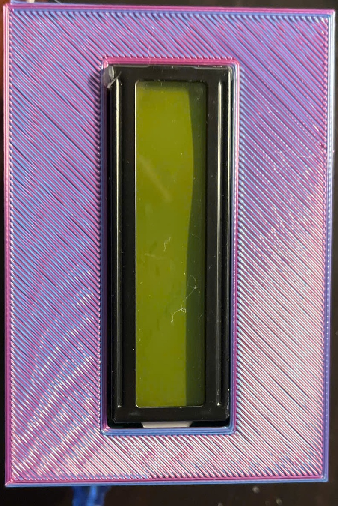
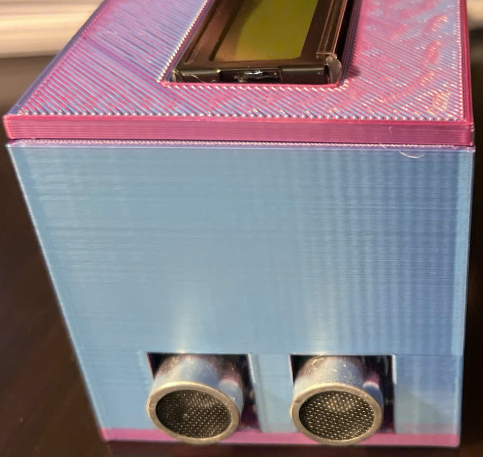

# Máy đo khoảng cách siêu âm HC‑SR04 + LCD I²C

<p align="center">
  
  
  
</p>

## Giới thiệu
Thư mục này chứa mã nguồn Arduino đo khoảng cách bằng cảm biến **HC‑SR04** và hiển thị kết quả trên màn hình **LCD 1602 I²C**. Chương trình lấy **5 mẫu**, lọc **median** để loại nhiễu, kiểm tra ngưỡng tin cậy (2 – 400 cm) rồi hiển thị & gửi về **Serial**.

<div align="center">
  <sub>Khoảng cách = 0 cm khi ngoài ngưỡng hoặc cảm biến timeout.</sub>
</div>

---

## Phần cứng
| Thiết bị | Số lượng | Ghi chú |
|----------|----------|---------|
| Arduino Uno/Nano/Pro Mini | 1 | 5 V logic |
| Cảm biến siêu âm **HC‑SR04** | 1 | Đo 2 – 400 cm |
| LCD 1602 I²C (địa chỉ `0x27`) | 1 | Giao tiếp I²C |
| Dây jump male–female | 1 bộ | Kết nối |
| Nguồn 5 V ổn định | 1 | ≥ 500 mA |

> ⚠️ Vui lòng dùng dây ≤ 25 cm cho tín hiệu Echo để giảm méo xung.

---

## Sơ đồ nối dây (tham khảo ảnh wiring)
| Chân HC‑SR04 | Chân Arduino | Mô tả |
|--------------|-------------|-------|
| VCC (5 V) | 5 V | Nguồn cảm biến |
| GND | GND | Mass chung |
| **Trig** | D8 | Xung phát |
| **Echo** | D7 | Xung thu |

| Chân LCD I²C | Chân Arduino | Mô tả |
|--------------|-------------|-------|
| VCC | 5 V | Nguồn LCD |
| GND | GND | Mass chung |
| **SDA** | A4 (Uno) | Dữ liệu I²C |
| **SCL** | A5 (Uno) | Xung I²C |

---

## Cài đặt
```bash
# 1. Clone repo
$ git clone https://github.com/your‑username/ultrasonic‑lcd.git
$ cd ultrasonic‑lcd

# 2. Mở "ultrasonic_lcd.ino" bằng Arduino IDE hoặc VS Code + PlatformIO

# 3. Cài thư viện
- LiquidCrystal_I2C (by Frank de Brabander hoặc tương đương)
- Wire (đã có sẵn)

# 4. Chọn bo mạch & cổng COM, nạp chương trình
```

---

## Cách hoạt động
1. **Khởi tạo** LCD, cảm biến và Serial 9600 bps.
2. **Phát xung** 10 µs trên Trig → cảm biến gửi sóng siêu âm.
3. **Đo độ rộng xung Echo** (µs) → quy đổi sang cm (`× 0.01724`).
4. **Lấy 5 mẫu → median** để khử nhiễu.
5. **Lọc** giá trị < 2 cm hoặc > 400 cm → đặt 0 cm.
6. **Hiển thị** "xx.x cm" trên LCD & in ra Serial.

---

## Tuỳ chỉnh
| Tham số | Mặc định | Ý nghĩa |
|---------|----------|---------|
| `N_SAMPLES` | 5 | Số mẫu median |
| `MIN_CM` / `MAX_CM` | 2 / 400 | Ngưỡng tin cậy |
| `US_TO_CM` | 0.01724 | Hệ số đổi µs→cm |

---

## Kết quả kỳ vọng
- Độ chính xác ±0.3 cm với vật phẳng, song song mặt cảm biến.
- Tốc độ làm mới ~5 Hz.

> Thử nghiệm: đặt vật cách 10 cm → LCD hiển thị **10.0 cm** ±0.2 cm.

---

## License
HUST © 2025 Vũ Đức Thuận

